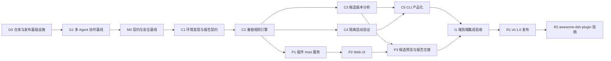

# 节点、依赖与里程碑

## 1. 里程碑管理规则

本计划把每个可独立验收的工程节点定义为一个 milestone。节点只有在退出门槛全部满足并产出规定证据后才能标记完成。

通用规则：

- “代码已写完”不是完成条件；测试、文档和可复核证据必须同时到位。
- 后继节点可以提前做不依赖接口的探索，但不能在前置契约未冻结时宣称完成。
- 任何已知不兼容组合被误报为绿色，立即阻断当前和后续 release 节点。
- 每次真实兼容事故必须先增加失败夹具，再修规则，禁止只修生产逻辑。
- 里程碑证据统一保存在 CI artifact 或版本化测试夹具中，不依赖口头确认。
- 变更退出码、报告 schema、状态语义或安全边界时，需要回到 M0 做设计变更评审。
- 变更 Git 根、workspace、版本或发布边界时，需要回到 G0 做仓库治理评审。
- 变更任务状态、认领事件、写入授权、范围冲突或交接语义时，需要回到 G1 做协作协议评审。
- R2 的内部完成条件是投稿与自动检查完成；外部维护者是否合并单独跟踪，不能阻断 R1。

## 2. 节点依赖图

## 3. 总览

| 节点 | 主要结果 | 硬性退出门槛 |
| --- | --- | --- |
| G0 | 单一 monorepo 与发布治理可执行 | 唯一 Git 根、单 lockfile、基础 CI 与敏感信息边界通过 |
| G1 | Issue 协调账本和多 Agent 写入协议可执行 | 单一有效认领、冲突停止、交接恢复和 no-lock 语义通过 |
| M0 | 状态、schema、退出码和安全边界冻结 | 设计评审通过，基准事故夹具可用 |
| C1 | 能准确发现宿主/profile/插件身份 | manifest-lock-actual 三方一致性测试通过 |
| C2 | 可解释的兼容规则引擎 | 已知不兼容组合零 false green |
| C3 | 安全的固定候选版本分析 | 不执行 lifecycle，不修改真实 profile |
| C4 | 隔离 dsh 启动验证 | 端口、进程和临时资源零泄漏 |
| C5 | 可安装、可自动化的 CLI | 命令/JSON/退出码契约测试通过 |
| P1 | 不拖垮宿主的只读 Host API | 扫描失败不导致 dsh 退出或日志风暴 |
| P2 | 可审查证据的 Web UI | 六种状态、stale、错误和无障碍 E2E 通过 |
| P3 | 候选预览与 CLI smoke 交接 | UI 不执行升级或任意命令 |
| I1 | 两个任务在真实矩阵中协同工作 | 本次事故矩阵全部通过 |
| R1 | 可复现的 v0.1.0 工件 | 干净环境安装、SBOM、签名/摘要和回退演练通过 |
| R2 | 可复核的 awesome-list 投稿 | 单条 YAML、上游 CI 绿色、描述声明均有证据 |

## 4. G0：仓库与发布基础设施

### 里程碑结果

建立可复现、边界明确的产品 monorepo，为后续所有代码、测试和发布节点提供唯一版本来源。

### 前置条件

- 六份权威设计文档、根 `AGENTS.md` 和 ADR-0001 进入评审；
- 已确认采用单一产品 monorepo；
- 尚未初始化 Git 时，不得把目标目录结构表述成已经落地。

### 交付物

- 位于 `dsh-compat-suite/` 的唯一产品 `.git`；
- 根 `package.json`、`pnpm-workspace.yaml` 和唯一 `pnpm-lock.yaml`；
- `packages/core`、`packages/cli`、`packages/dsh-plugin` workspace 骨架；
- `.gitignore`、`.gitattributes`、LICENSE、SECURITY、CONTRIBUTING 和 CHANGELOG；
- GitHub implementation Issue Form、PR 模板、CODEOWNERS 与 PR/controlled-smoke/release workflow 骨架；
- Changesets lockstep 配置；
- canonical GitHub remote、npm scope 发布权限和许可证决策记录；
- fixture 来源清单格式和 release 工件命名规范。

### 退出门槛

- `git rev-parse --show-toplevel` 精确指向 `dsh-compat-suite/`；
- 产品树内不存在嵌套 `.git`、submodule 或 subtree；
- 根 package 标记 `private: true`，且只存在一个 lockfile；
- 干净 checkout 可以执行冻结依赖安装和 workspace 构建；
- package 依赖方向符合 `doctor/plugin -> core`，不存在反向或循环依赖；
- canonical remote、package repository、默认分支和 CI 地址一致；
- 维护者拥有最终 npm scope，根/package 许可证元数据一致；
- PR workflow 在无 secrets 的 fork 模式下可运行；
- `AGENTS.md`、Issue Form 和 PR 模板可从干净 checkout 读取且 YAML/Markdown 结构有效；
- tracked files 扫描无真实 DSH/PM2 数据、credential、token 或未授权绝对路径；
- 测试运行后工作树保持 clean。

### 必须保存的证据

- 仓库拓扑和嵌套 Git 扫描结果；
- workspace/lockfile 一致性输出；
- clean checkout 安装日志；
- package dependency graph；
- remote/scope/license 核对记录；
- secret/path scan 报告；
- Issue/PR 模板与 `AGENTS.md` 静态校验结果；
- required checks 与 branch protection 配置快照。

## 5. G1：多 Agent 协作基线

### 里程碑结果

建立可执行、可恢复、可复核的多 Agent 任务认领协议。GitHub Issue 只记录范围、认领、进度和交接，不作为文件、分支或任务锁。

### 前置条件

- G0 完成，canonical GitHub repository 和 Issue tracker 可用；
- `AGENTS.md`、协作协议、ADR-0001、Issue Form 和 PR 模板已经进入仓库；
- 协调者身份和至少两个测试 `agent_id` 已定义；
- 当前 GitHub/branch protection 能力已读取并准备记录实测结果。

### 交付物

- `status:*`、`type:*`、`component:*` 和 `review:*` label 定义及创建记录；
- implementation Issue Form 和 PR 模板；
- `CLAIM_REQUESTED`、`CLAIM_CONFIRMED`、进度、范围变化、阻塞、交接和完成事件格式；
- 路径前缀与 `shared_interfaces` 冲突判定规则；
- 独立 branch/worktree 命名和恢复规则；
- GitHub 不可用、branch protection 不可用和共享账号场景的 fallback；
- L9 协作治理测试夹具与证据；
- 可选只读 preflight 的接口设计，不实现锁。

### 退出门槛

- 两个 Agent 同时请求同一 Issue 时只产生一个有效 `CLAIM_CONFIRMED`；
- 未获确认者保持只读，且测试不声称 GitHub 技术上阻止了写入；
- 直接路径重叠、生成物重叠、根 lockfile 和共享接口重叠均能触发暂停与协调；
- 两个范围不重叠的任务能在不同 worktree 并行，并通过各自 PR 集成；
- scope revision 改变后，旧 claim 不能授权新增范围；
- `expected_update_at` 到期不会自动转移任务，协调者完成分支/PR/工作状态审计后才能确认接手；
- 异常中止和正常 handoff 均可由另一 Agent 从固定 SHA 恢复并复跑基线；
- PR 缺少 Issue、`claim_id`、范围、验证或必要评审时不能通过验收；
- 仓库中不存在 claim lockfile、中央锁依赖或“已锁定”的误导性状态；
- GitHub 和 branch protection 当前能力有实测证据；不可强制项有明确人工门槛；
- bootstrap 工作已回填或关闭，G1 通过后 bootstrap 写入例外失效。

### 必须保存的证据

- 两 Agent 竞态和冲突处置时间线；
- 非重叠并行 worktree/PR 记录；
- scope revision、失效认领和 handoff 恢复记录；
- Issue Form、事件格式、状态转换和 PR 模板校验；
- 当前 GitHub capability/branch protection 检查；
- `G1 accepted` 协调者记录和 bootstrap 关闭记录。

G1 通过不表示平台提供互斥，也不表示产品代码已经实现；它只证明参与者能够按可审计协议协作。

## 6. M0：契约与安全基线

### 里程碑结果

冻结第一版兼容状态、证据类型、退出码、报告 schema、安全边界和基准测试组合。

### 前置条件

- G1 完成；
- 本目录的设计文档进入评审；
- 已确认 CLI 为权威闸门、插件为 UI 入口。

### 交付物

- report schema v1 草案；
- finding code 命名规范；
- CLI 退出码表；
- 脱敏规范；
- 本次三插件事故的固定 fixture 定义；
- threat model 和非目标清单；
- 规则优先级文档。

### 退出门槛

- `validated_compatible`、`declared_compatible`、`degraded`、`incompatible`、`unknown`、`scan_error` 的语义无重叠；
- 明确“不存在错误”不能产生 `validated_compatible`；
- 每个阻断结论至少需要一种可追溯证据；
- 报告 schema 能表达宿主版本偏移、插件版本三方不一致和 smoke 覆盖范围；
- 安全评审确认 MVP 无 profile 写入、安装、重启和任意 shell 执行。

### 必须保存的证据

- 评审记录；
- schema validation 输出；
- 六种状态的最小 golden report；
- 威胁模型 checklist。

## 7. C1：环境发现与报告契约

### 里程碑结果

CLI 能在 dsh 运行、停止和启动失败三种状态下，准确生成当前环境 inventory。

### 前置条件

- M0 完成；
- report schema v1 冻结。

### 交付物

- dsh binary/realpath/version resolver；
- 核心 package 版本发现器；
- profile manifest、pnpm lock v9 和 node_modules parser；
- bundle loader ID 与 disabled 状态解析；
- manifest-lock-actual reconciliation；
- 路径别名化和脱敏器；
- `scan --json` 初版。

### 退出门槛

- 能识别当前基线 `dsh 0.1.1-rc.2` 及其核心包；
- 三方版本一致、manifest/lock 不一致、lock/actual 不一致、包缺失和重复解析均有测试；
- dsh 进程未启动时扫描结果不缺失 package 身份；
- dsh 本身崩溃时 CLI 不依赖其 Host API；
- 无权限和损坏文件均产生 `scan_error`，不崩溃、不输出绿色；
- 归一化 JSON 连续运行两次结果一致，除允许变化的 run metadata 外。

### 必须保存的证据

- 单元测试和 fixture 列表；
- 当前本机脱敏 inventory 示例；
- golden JSON diff；
- 无 dsh 进程场景的测试日志。

## 8. C2：兼容规则引擎

### 里程碑结果

对当前组合给出可解释、确定性且保守的兼容结论。

### 前置条件

- C1 完成；
- inventory schema 稳定。

### 交付物

- prerelease-aware semver evaluator；
- `dsh.engines` 和 mandatory/optional peer 规则；
- host/core version skew 规则；
- known compatibility matrix loader；
- API surface index 和缺失 API finding；
- 规则优先级、冲突消解和 evidence aggregation；
- `explain` 数据层。

### 退出门槛

- `0.1.1-rc.2` 正确拒绝 `>=0.1.2-alpha.1`；
- AgentTeams `0.1.15` 对 `0.1.1-rc.2` 不能产生绿色；
- task-board/skill-explorer `0.3.10` 对 `0.1.1-rc.2` 均为 `incompatible`；
- 缺少 engine/peer 且无矩阵的插件为 `unknown`；
- runtime deny 或明确缺失 API 不能被宽泛 manifest allow 覆盖；
- rule engine 单元分支覆盖率达到验证方案要求；
- 同一输入的 finding 顺序和 ID 稳定。

### 必须保存的证据

- 基准矩阵测试报告；
- 每条规则的正反例；
- AgentTeams 缺失 API golden finding；
- rule precedence property test 输出。

## 9. C3：候选版本分析

### 里程碑结果

CLI 可以安全分析一个固定 npm 候选版本，并生成当前/目标差异报告。

### 前置条件

- C2 完成；
- registry 和 tarball threat model 通过评审。

### 交付物

- 精确 package spec parser；
- registry adapter 和 allowlist；
- integrity-aware cache；
- 安全 tar 列表/展开器；
- 当前与候选 manifest、peer、engine、bundle 和 API diff；
- `check-update` 命令；
- offline cache 命中路径。

### 退出门槛

- 拒绝 `latest`、semver range、Git URL、本地路径和 shell 控制字符；
- tarball integrity 不匹配立即阻断；
- 路径穿越、绝对路径、设备文件、异常 symlink 和压缩炸弹夹具均被拒绝；
- 候选分析期间真实 profile 的 manifest、lock 和 node_modules digest 不变化；
- 任意候选 package lifecycle script 均未执行；
- 网络失败产生可区分的基础设施结果，不把当前版本误判为候选版本。

### 必须保存的证据

- 网络请求记录摘要；
- profile before/after digest；
- 恶意 tar 测试报告；
- 候选差异 golden report。

## 10. C4：隔离启动验证

### 里程碑结果

CLI 能在独立环境启动指定组合，得到可靠的 ready、稳定性、HTTP 和退出判定。

### 前置条件

- C2 完成；
- process lifecycle 和网络边界评审通过。

### 交付物

- 临时 DSH_HOME/profile builder；
- dsh 版本适配器；
- loopback 端口分配与冲突重试；
- 子进程组管理和超时；
- ready/HTTP/log classifier；
- 稳定观察窗口；
- 清理审计；
- `smoke` 命令。

### 退出门槛

- 不接触正式 PM2 app、正式端口和真实 plugin storage；
- AgentTeams `0.1.15` 组合能稳定复现 loader failure；
- 降级组合能达到 ready 并通过稳定观察窗口；
- ready 后崩溃、日志风暴、端口消失和僵尸子进程场景均能识别；
- Ctrl-C、总超时、探针超时和子进程异常均无进程/端口/临时文件泄漏；
- 无法强制网络隔离时报告明确标记，不声称无网络副作用；
- smoke 不创建模型会话、不发送提示词。

### 必须保存的证据

- 每个 fixture 的脱敏 stdout/stderr 摘要；
- PID/端口 before-after 清理清单；
- ready 和 shutdown 时间；
- 失败组合与成功组合的 smoke report。

## 11. C5：CLI 产品化

### 里程碑结果

交付可安装、可自动化、契约稳定的 `dsh-compat-doctor` release candidate。

### 前置条件

- C3 和 C4 完成。

### 交付物

- `scan`、`check-update`、`smoke`、`explain` 完整命令；
- 文本和 JSON reporter；
- shell completion（可选，不阻断 MVP）；
- 用户文档和故障排查；
- npm package、provenance、SBOM；
- CI/升级脚本集成示例；
- disposable PM2_HOME 验证示例。

### 退出门槛

- 所有命令在干净安装环境可运行；
- 退出码契约测试覆盖所有状态组合；
- `--json` stdout 永远是单个合法 JSON 文档；
- 敏感信息扫描无 token、credential 或未授权绝对路径；
- offline scan 不产生网络请求；
- strict/advisory 策略行为符合文档；
- CLI 在 dsh 启动失败状态下仍能解释根因。

### 必须保存的证据

- 安装日志；
- package checksum、SBOM 和 provenance；
- CLI contract test；
- 脱敏扫描报告；
- PM2 外层预检演示记录。

## 12. P1：插件 Host 服务

### 里程碑结果

dsh 插件能够以惰性、只读、故障隔离的方式提供当前兼容报告 API。

### 前置条件

- C2 完成；
- core API 和 report schema 稳定。

### 交付物

- loader bundle 和精确 engine 声明；
- Host service、配置 schema 和惰性扫描；
- `/status`、`/report`、`/scan`；
- in-flight dedup、TTL cache 和错误限流；
- CLI report reader/digest matcher；
- dispose 清理。

### 退出门槛

- loader apply 不执行扫描或网络；
- 扫描异常不向上导致宿主退出；
- 连续失败不产生高频日志风暴；
- 路径、profile 和 report 文件不能由浏览器任意指定；
- 无效或 stale CLI report 不覆盖当前 live identity；
- 插件被禁用/破坏时 CLI 仍正常工作。

### 必须保存的证据

- Host API contract test；
- loader timing；
- 失败注入日志频率统计；
- 插件禁用和破坏场景的 CLI 报告。

## 13. P2：Web UI

### 里程碑结果

用户可以在 dsh Web 中审查宿主、插件、风险和证据，而不会混淆静态与运行验证。

### 前置条件

- P1 完成；
- UI 状态词和文案评审通过。

### 交付物

- summary header；
- plugin inventory table；
- finding detail drawer；
- stale/source/smoke coverage 提示；
- refresh/export；
- loading、empty、degraded、error 状态；
- 中英文 locale；
- 键盘和屏幕阅读器支持。

### 退出门槛

- 六种状态不只依赖颜色区分；
- 静态报告不能显示成“已验证兼容”；
- finding 能追溯 observed、expected 和 evidence；
- 扫描失败时保留上一份报告并标记 stale；
- 报告中的不可信文本不能注入 HTML；
- 桌面宽屏、窄侧栏和键盘流程 E2E 通过。

### 必须保存的证据

- 浏览器 E2E 报告；
- 关键状态截图；
- accessibility 扫描；
- 恶意文本渲染测试。

## 14. P3：候选预览与 CLI 报告交接

### 里程碑结果

UI 能安全展示固定候选版本的静态差异，并与外部 CLI smoke 报告完成 digest 对齐。

### 前置条件

- C3 和 P2 完成。

### 交付物

- `/candidate-check`；
- candidate preview UI；
- CLI smoke 命令生成器；
- report file reader 和 current-input digest 匹配；
- registry disabled/failed 状态；
- report export。

### 退出门槛

- 只接受 package name + exact version；
- 页面加载不自动访问 registry；
- UI 不执行安装、重启或任意命令；
- smoke report 只有在宿主/profile/candidate digest 全匹配时合并；
- stale report 明确隔离，不提升当前状态；
- candidate 请求具备鉴权、限流和大小限制。

### 必须保存的证据

- candidate API 安全测试；
- digest match/mismatch E2E；
- registry disabled 和网络失败 UI 截图；
- 生成命令的参数转义 contract test。

## 15. I1：端到端集成验收

### 里程碑结果

CLI 与插件使用同一报告语义，在真实 dsh 版本矩阵中给出一致结论。

### 前置条件

- C5 和 P3 完成。

### 交付物

- 完整 fixture matrix runner；
- CLI → report file → plugin UI 的 E2E；
- disposable PM2_HOME 集成测试；
- upgrade preflight 示例；
- rollback rehearsal；
- 性能和资源报告。

### 退出门槛

- 本次六个关键组合全部得到预期结论；
- 已知不兼容组合零 false green；
- CLI 和 UI 对同一 report 的总体状态一致；
- 正式 dsh profile、PM2_HOME、端口和插件数据在测试前后 digest/状态不变；
- 两次连续运行产生相同归一化结论；
- 故障注入、安全、清理和性能预算全部通过。

### 必须保存的证据

- 端到端测试报告；
- before/after 环境审计；
- UI 截图和 CLI JSON；
- rollback 演练记录；
- 资源泄漏检查。

## 16. R1：v0.1.0 发布

### 里程碑结果

发布可复现、可回退、文档完整的 CLI 和 dsh 插件首版。

### 前置条件

- I1 完成；
- 无未关闭的 critical/high 安全问题；
- schema 和退出码进入兼容承诺期。

### 交付物

- `@dsh-compat/core@0.1.0`；
- `@dsh-compat/doctor@0.1.0`；
- `@dsh-compat/plugin@0.1.0`；
- 对应同一 release commit 的 annotated `v0.1.0` tag；
- checksum、provenance 和 SBOM；
- 安装、使用、升级前检查和卸载文档；
- 已验证 dsh 版本矩阵；
- 已知限制；
- 回退说明。

### 退出门槛

- 从干净环境按文档安装成功；
- tag、三个 package 版本、内部依赖与 CHANGELOG 一致；
- packed manifest 不含 `workspace:`、`link:`、本机路径或未替换占位符；
- 发布工件与 CI 验证工件摘要一致；
- CLI 不安装插件也能运行；
- 插件卸载后不影响 dsh 和 CLI；
- 发布说明没有把 declared 或 startup-only 兼容夸大为完整功能兼容；
- 从 release candidate 回退到上一个稳定状态的演练通过。

### 必须保存的证据

- 发布工件摘要；
- release commit SHA、tag 与 package identity 对照；
- provenance/SBOM；
- clean-room 安装日志；
- release acceptance checklist；
- 回退演练日志。

## 17. R2：awesome-dsh-plugin 投稿

### 里程碑结果

把已发布插件作为一个可安装、描述准确且不与产品仓库耦合的条目提交到 `awesome-dsh-plugin`。

### 前置条件

- R1 完成；
- 重新读取并记录上游 README 与 `contributing.md` 当前版本；
- 产品仓库公开、存在至少 1 天并设置 `dsh-plugin` topic；
- 已完成与现有同类 doctor、clinic、audit、depguard、forge 条目的差异核对。

### 交付物

- 独立的 `awesome-dsh-plugin` fork/checkout 和投稿分支；
- `data/plugins/<owner>__dsh-compat-suite--packages-dsh-plugin.yml`；
- 准确的中英文一句话描述和 `dev` 分类依据；
- 可选 `packages/dsh-plugin/screenshots.json`；
- 收录前清单、clean install 记录和功能声明证据；
- 外部 PR 链接。

### 退出门槛

- 公开 URL 可通过 `dsh plugin add` 在干净环境安装；
- package 声明有效 `dsh.bundle`、repository directory 和真实 prerelease-aware peers；
- 投稿只新增本项目的一条 YAML，不改其他条目，不手工修改生成 README；
- 在外部 checkout 运行上游 generator/lint/site build 后结果符合上游规则；
- YAML 中 URL、名称、分类和每项描述均可由已发布代码与测试证明；
- 上游自动检查绿色；
- 产品仓库不包含外部 fork、上游依赖或提交 token。

### 必须保存的证据

- 上游规则核对日期和 commit SHA；
- YAML 与生成预览；
- 上游 CI 链接；
- 功能声明到代码/测试的映射；
- 外部 PR URL 与状态：`external_pending`、`listed` 或 `changes_requested`。

维护者合并不是 R1 的发布门槛。若上游发现真实产品缺陷，应回到对应工程节点修复并发布新版本；不能仅修改条目描述掩盖缺陷。

## 18. 变更与回退规则

- C1 之后修改 inventory identity：回归 C1、C2、C4、P1、I1。
- C2 之后修改状态或规则优先级：回归所有后续节点。
- 修改 report schema：CLI 与插件必须同一变更集更新，并增加旧报告迁移/拒绝测试。
- 修改 smoke 隔离策略：必须重新执行进程、端口、数据和网络边界测试。
- 修改 Web 写型 API：必须重新做威胁模型和安全验收。
- 修改 Git 根、workspace、lockstep 或 release workflow：回归 G0、I1、R1。
- 修改 Issue 字段、状态机、event schema、范围冲突或 handoff 规则：回归 G1；若影响 PR/release 门槛，同时回归 I1、R1。
- 修改插件公开仓库路径、`dsh.bundle` 或条目声明：回归 P1、P3、R1、R2。
- 上游收录规则变化：先更新仓库治理文档，再重新执行 R2，不反向改写已完成的 R1 证据。
- 任一 release 出现 false green：立即撤回对应兼容矩阵 allow，发布规则修订，并把事故加入永久 fixture。
