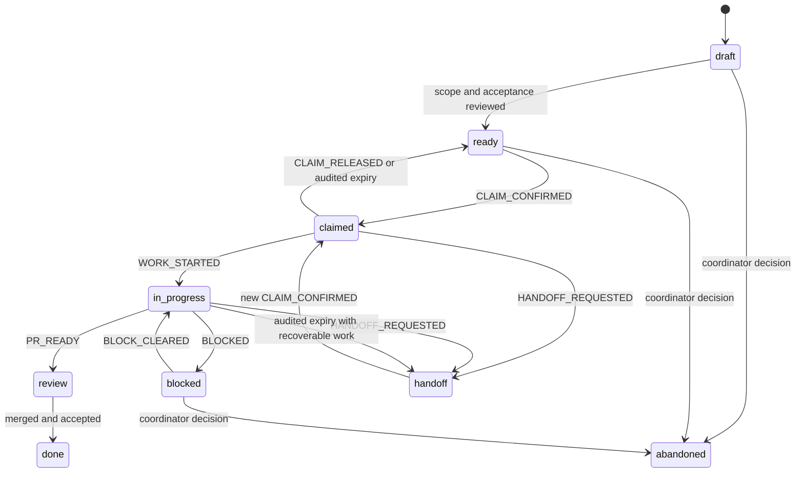

# 多 Agent 任务认领与协作协议

状态：设计基线 v1
日期：2026-09-04
适用对象：人类维护者、Codex/其他编码 Agent、评审 Agent、验证 Agent 和未来协调自动化

## 1. 目标

本文定义多个 Agent 在同一 `dsh-compat-suite` monorepo 中混合工作时，如何选择任务、记录认领、检查冲突、隔离写入、同步进度、转交工作、评审和完成验收。

协议要达到四个结果：

1. 任意时刻可以回答“谁在做什么、允许改哪里、基于哪个提交、下一次何时复核”；
2. 路径不重叠但语义相关的工作也能发现冲突；
3. Agent 中断后，另一参与者可根据 Issue、分支和验证证据恢复现场；
4. 协调机制不被误解为平台级锁或安全隔离。

## 2. 非目标

本协议不尝试：

- 通过文件锁、Git lock、数据库 mutex 或中央租约服务阻止写入；
- 保证 GitHub API 更新是原子 compare-and-set；
- 把 assignee、label、Project 字段、评论、分支或 worktree 描述成锁；
- 允许一个 Issue 覆盖不相关的多个实现目标；
- 代替 Git merge、CI、CODEOWNERS、安全评审或产品验收；
- 使用协调记录授权访问真实 DSH profile、PM2 数据、凭据或发布 secrets；
- 在 MVP 中构建复杂的 `/claim` Bot。

“未确认不得写入”是一条 fail-closed 的参与者规则，不是技术互斥承诺。正式决策见
[`ADR-0001`](adr/0001-issue-ledger-not-lock.md)。

## 3. 信息权威与职责分层

| 信息层 | 主要内容 | 是否权威 | 是否是锁 |
| --- | --- | --- | --- |
| `AGENTS.md` 与设计/ADR | 长期规则、安全边界、流程 | 是 | 否 |
| Issue 正文 | 目标、非目标、范围、依赖、验收 | 是，限该任务 | 否 |
| Issue 协调事件 | 请求、确认、进度、变更、交接 | 是，按有效事件顺序解释 | 否 |
| assignee、label、Project | 查询和看板投影 | 否，必须能由 Issue 记录重建 | 否 |
| branch/worktree | 实际修改隔离和恢复载体 | 代码事实 | 否 |
| PR | diff、验证、审查和验收入口 | 是，限拟合并变更 | 否 |
| CI artifact/release evidence | 可复核测试与发布证据 | 是，限对应 SHA | 否 |

协调事件原则上使用新评论追加。GitHub 评论可以被有权限的人修改或删除，因此本文只称其为“可审计协调记录”，不称为不可变日志。需要更强审计时，应导出脱敏时间线快照并按 commit digest 保存为 CI artifact。

## 4. 角色和身份

### 4.1 角色

| 角色 | 责任 |
| --- | --- |
| 维护者 | 决定产品方向、权限、发布和协议例外 |
| 协调者 | 准备 Issue、核对冲突、确认认领、处理失效和交接 |
| 实现 Agent | 在确认范围内修改、测试、记录进展并发起 PR |
| 规格评审者 | 核对实现是否满足目标、非目标和状态语义 |
| 安全/质量评审者 | 核对信任边界、失败路径、测试和回退 |
| 验证 Agent | 独立复跑验收，不修改被验证分支，除非重新认领修复任务 |

一个人或系统可以承担多个角色，但关键 schema、安全、进程、规则 allow 和 release workflow 变更不得把作者自评表述为独立审查。

### 4.2 `agent_id`

每个参与实例使用稳定且可读的 `agent_id`，例如：

```text
codex-local-01
claude-review-02
human-maintainer-01
```

`agent_id` 只用于协调区分。若多个 Agent 共用一个 GitHub 账号，它不提供身份认证；GitHub 评论的真实 author 与声明字段应同时保留。不得把 `agent_id` 放入 package、运行时遥测或用户报告。

## 5. 任务 Issue 契约

实现任务使用 [`.github/ISSUE_TEMPLATE/implementation.yml`](../.github/ISSUE_TEMPLATE/implementation.yml)。Issue 在进入 `status:ready` 前必须具备：

- 一个可观察的 `objective`；
- 明确的 `non_goals`；
- parent Issue 或 milestone；
- `blocked_by` 和 `blocking` 依赖；
- 初始值为 `1` 的 `scope_revision`；
- 精确 `write_scope`；
- `forbidden_scope`；
- `shared_interfaces`；
- 可独立复核的 acceptance criteria；
- 正例、反例和失败路径验证；
- 安全、隐私、外部副作用和 rollback；
- 文档影响；
- 建议的进度复核间隔。

缺字段时保持 `status:draft`。协调者只能在目标可拆分、依赖可判断、范围可核对且验证可执行后设置 `status:ready`。

### 5.1 范围格式

`write_scope` 和 `forbidden_scope` 使用仓库相对路径：

```text
packages/core/src/rules/
tests/rules/
docs/01-cli-design.md
```

规则如下：

- 目录以 `/` 结尾，表示允许其下新建和修改文件；
- 文件写完整路径；
- 禁止绝对路径、`..`、主目录缩写和含糊的“相关文件”；
- `**` 只能在整个组件明确归属于该 Issue 时使用；
- 删除、移动和批量生成必须在 Issue 中单独说明；
- 根 `package.json`、`pnpm-lock.yaml`、schema、公共 exports、workflow 等必须同时列入 `shared_interfaces`。

### 5.2 范围修订

Issue 正文中的范围使用递增的 `scope_revision`，初始为 `1`。每次修改目标、范围、共享接口或验收条件：

1. 增加 revision；
2. 在 Issue 中说明差异和原因；
3. 使旧确认对新增范围失效；
4. 由实现 Agent 发布 `SCOPE_CHANGE_REQUESTED`；
5. 由协调者发布 `SCOPE_CHANGE_CONFIRMED` 后才允许新增写入。

旧范围中已完成的工作不因 revision 自动失效，但必须重新核对是否仍满足新目标。

### 5.3 任务拆分

- milestone 表示阶段门槛，不直接授予任何 Agent 写入范围；
- tracking/parent Issue 汇总跨包目标、依赖和子任务，默认不被认领用于实现；
- implementation Issue 是认领、branch、worktree、PR 和验收的最小单位；
- 一个 implementation Issue 应能由一个实现 Agent 在一个主要 PR 中完成；
- 可以独立验收、由不同 owner 完成或写入范围不同的工作必须拆为子 Issue；
- 子 Issue 层级只表达分解，执行顺序仍使用显式 `blocked_by`/`blocking`；
- 跨包改动若不能安全拆开，应建立一个 implementation Issue 和一个 integration owner，而不是让多个 Agent 分别修改同一契约；
- tracking Issue 不应声明覆盖所有子任务路径的 `write_scope`，避免与子 Issue 形成伪重叠认领。

## 6. 状态机

每个 implementation Issue 最多拥有一个 `status:*` label：



| 状态 | 含义 | 进入条件 |
| --- | --- | --- |
| `status:draft` | 任务尚不能认领 | 字段、依赖或范围未准备完成 |
| `status:ready` | 可请求认领 | 协调者完成可执行性复核 |
| `status:claimed` | 一个实现 Agent 获得流程授权 | 有有效 `CLAIM_CONFIRMED` |
| `status:in-progress` | 已建立隔离工作区并开始写入 | 有 `WORK_STARTED` |
| `status:blocked` | 无法继续，仍需协调者决定是否保留 owner | 有具体 blocker 和恢复条件 |
| `status:handoff` | 正在转交，不允许新旧 Agent 并行写入 | 有完整 handoff 记录 |
| `status:review` | PR 已达到可审查状态 | 验证摘要和 PR 链接完整 |
| `status:done` | 变更已合并并通过验收 | PR、证据和残留工作核对完成 |
| `status:abandoned` | 任务取消或被替代 | 原因和替代 Issue 已记录 |

label 是状态投影。若 label 与协调事件不一致，参与者必须停止并要求协调者修复，而不能选择对自己最有利的状态。

### 6.1 Label 目录

G0 创建、G1 验证以下最小 label；未列出的 label 可以用于查询，但不能改变写入权限：

| 类别 | Label | 约束 |
| --- | --- | --- |
| 状态 | `status:draft`、`status:ready`、`status:claimed`、`status:in-progress`、`status:blocked`、`status:handoff`、`status:review`、`status:done`、`status:abandoned` | 同一 Issue 最多一个 |
| 类型 | `type:tracking`、`type:implementation` | tracking Issue 不获得实现 claim |
| 组件 | `component:core`、`component:cli`、`component:plugin`、`component:schema`、`component:rules`、`component:docs`、`component:infra`、`component:release`、`component:ecosystem` | 可以多个，但必须与范围一致 |
| 评审 | `review:specification`、`review:security-quality`、`review:release` | 表示仍需或正在进行的评审，不表示批准 |
| 协调 | `coordination:conflict`、`coordination:stale` | 只提示异常，不能自动取消或转移 claim |

`status:done` 应在验收完成后关闭 Issue；不要用关闭动作代替 `WORK_COMPLETED` 记录。

## 7. 认领协议

### 7.1 Start read-only

实现 Agent 首先只读检查：

- `AGENTS.md` 和相关设计；
- Issue 是否为 `status:ready`；
- 依赖是否关闭或明确解除；
- 当前 `main` HEAD；
- 所有 `status:claimed`、`status:in-progress`、`status:blocked`、`status:handoff` 和 `status:review` Issue；
- 路径前缀和共享接口是否重叠；
- 是否存在无归属分支、Draft PR 或脏 worktree。

只读分析可以并行；写入不能从“暂时没看到冲突”自动推导。

### 7.2 `CLAIM_REQUESTED`

Agent 在 Issue 新增一条评论：

```yaml
protocol: dsh-compat-collaboration/v1
event: CLAIM_REQUESTED
agent_id: codex-local-01
github_actor: "@example"
issue: 123
scope_revision: 1
base_sha: 0123456789abcdef0123456789abcdef01234567
proposed_branch: feat/123-rule-engine
write_scope:
  - packages/core/src/rules/
  - tests/rules/
shared_interfaces:
  - schemas/report-v1.schema.json
conflicts_checked_at: 2026-09-04T08:00:00Z
expected_update_at: 2026-09-04T12:00:00Z
notes: No active path overlap found; schema review is required.
```

请求事件不得自行填写有效 `claim_id`，也不得提前把 Issue 标成 `status:claimed`。

### 7.3 协调者复核

协调者重新检查：

1. Issue revision 与请求一致；
2. 依赖已解除；
3. agent、branch 和 base SHA 可识别；
4. 直接路径无重叠；
5. generated files、lockfile 和共享接口无隐式重叠；
6. 安全/发布范围有相应 reviewer；
7. 建议更新时间合理；
8. 当前没有另一个有效确认。

发现冲突时发布 `CLAIM_REJECTED` 或要求拆分，不删除原请求。

### 7.4 `CLAIM_CONFIRMED`

通过后，协调者新增：

```yaml
protocol: dsh-compat-collaboration/v1
event: CLAIM_CONFIRMED
claim_id: issue-123-20260904T080500Z-codex-local-01
agent_id: codex-local-01
issue: 123
scope_revision: 1
base_sha: 0123456789abcdef0123456789abcdef01234567
branch: feat/123-rule-engine
write_scope:
  - packages/core/src/rules/
  - tests/rules/
shared_interfaces:
  - schemas/report-v1.schema.json
expected_update_at: 2026-09-04T12:00:00Z
required_reviews:
  - specification
  - security-quality
coordinator_id: human-maintainer-01
```

`claim_id` 在 Issue 生命周期内唯一。它是记录关联键，不是 capability token；知道该字符串不会获得权限。

### 7.5 开始工作

Agent 收到确认后：

1. 再次读取 Issue 最新事件；
2. 检查 `main` 是否偏离 `base_sha`；
3. 若偏移影响范围或共享接口，保持只读并请求复核；
4. 创建约定分支和外部 worktree；
5. 确认新 worktree clean；
6. 发布 `WORK_STARTED`，包含实际 branch、HEAD、worktree 标识和首个验证计划；
7. 将 label 投影为 `status:in-progress`。

不得先修改再补 claim。

## 8. 冲突判定

### 8.1 直接路径重叠

以下任一情况视为重叠：

- 两个任务写同一文件；
- 一个任务写目录前缀，另一个写该目录内文件；
- 两个任务会重新生成同一文件；
- 一个任务移动/删除另一个任务依赖的文件；
- 两个任务修改同一个 package 的依赖并都会改根 lockfile。

### 8.2 语义重叠

即使路径不同，以下情况也需要协调：

- schema 生产者与消费者改变同一字段含义；
- 规则优先级与 CLI/UI 状态展示同时变化；
- package exports 与跨包 import 同时变化；
- process/smoke 协议与清理测试同时变化；
- release workflow 与 package/release identity 同时变化；
- 文档和实现对同一公共契约给出不同状态语义。

无法确定是否重叠时按“可能重叠”处理，由协调者选择：

- 调整执行顺序；
- 缩小范围；
- 建立共同父 Issue 和明确 integration owner；
- 合并为一个实现 Issue；
- 为只读评审保留并行，但不允许双方写入。

### 8.3 竞态处理

若两个请求几乎同时出现，协调者按依赖、准备程度和项目优先级选择一个，而不是简单以评论毫秒顺序决定。未获确认者保持只读。

若错误地产生两个确认：

1. 两个 Agent 都立即停止相关写入；
2. 发布 `COORDINATION_CONFLICT`；
3. 记录各自 branch、HEAD 和修改路径；
4. 协调者明确保留哪个 claim；
5. 另一任务拆分、交接或废弃；
6. 通过 diff 和测试证明恢复没有遗漏。

该恢复流程再次说明：记录可以发现和修复冲突，但不能像锁一样阻止冲突发生。

## 9. 分支、worktree 与提交

默认分支格式：

```text
feat/<issue>-<slug>
fix/<issue>-<slug>
docs/<issue>-<slug>
rules/<issue>-<slug>
release/<issue>-<version>
```

worktree 位于产品根之外：

```text
<workspace>/dsh-compat-suite-wt-<issue>-<agent-id>/
```

要求：

- 一个活跃实现 Agent 使用一个 worktree；
- 不在另一个 Agent 的 checkout 中运行格式化或生成器；
- commit 只包含确认范围；
- commit message 或 PR 必须可追溯到 Issue；
- 每个 commit message 必须包含机器可读的 `Agent-ID: <agent_id>` trailer；其值必须与当前有效认领或协调事件中的 `agent_id` 一致。G0 bootstrap 没有 Issue 时，使用维护者在 bootstrap 任务中明确指定的 `agent_id`；
- 不强制推送、不改写其他 Agent branch；
- rebase 前检查共享接口和 base 偏移；
- 依赖变更和 lockfile 更新必须在 Issue 中明确声明；
- 外部 `awesome-dsh-plugin` fork 使用独立目录、remote 和 Issue/PR，不复用产品 worktree。

## 10. 进度与陈旧认领

`expected_update_at` 表示下一次应复核记录的时间。它用于发现失联，不是租约锁，也不会自动释放或转移任务。

进度事件至少包含：

```yaml
protocol: dsh-compat-collaboration/v1
event: PROGRESS_UPDATE
claim_id: issue-123-20260904T080500Z-codex-local-01
agent_id: codex-local-01
head_sha: fedcba9876543210fedcba9876543210fedcba98
completed:
  - Added failing prerelease boundary test.
remaining:
  - Implement precedence resolver.
verification:
  - pnpm test --filter core -- semver
blockers: []
scope_change: false
next_update_at: 2026-09-04T16:00:00Z
```

超过更新时间后：

1. 协调者检查最近评论、PR、remote branch 和已知本地状态；
2. 尝试联系 owner；
3. 若工作仍可恢复，发布新的复核时间；
4. 若认领应结束，发布 `CLAIM_EXPIRED` 并说明保留的 branch/SHA；
5. 只有完成该审计后，才可确认新 Agent。

不得由时间到期直接假定“文件已解锁”。

## 11. 阻塞、范围变化和交接

### 11.1 阻塞

`BLOCKED` 必须记录：

- 精确 blocker；
- 已尝试的安全检查；
- 是否存在未推送修改；
- 受影响范围；
- 解除条件；
- 建议保留还是释放当前 owner；
- 下一次复核时间。

困难、耗时或测试尚未完成本身不等于 blocker。

### 11.2 范围变化

新增路径、修改公共接口、触碰真实服务、增加外部写操作或降低验证门槛都属于实质范围变化。Agent 必须先停止新增范围并请求确认；不能用“顺手修复”规避 Issue 拆分。

### 11.3 交接

交出方发布：

```yaml
protocol: dsh-compat-collaboration/v1
event: HANDOFF_READY
claim_id: issue-123-20260904T080500Z-codex-local-01
agent_id: codex-local-01
branch: feat/123-rule-engine
head_sha: fedcba9876543210fedcba9876543210fedcba98
worktree_state: clean
changed_paths:
  - packages/core/src/rules/prerelease.ts
  - tests/rules/prerelease.test.ts
completed:
  - Added failing and passing boundary cases.
remaining:
  - Wire rule into aggregate decision.
verification:
  - "pnpm test --filter core: pass"
known_risks:
  - Schema output has not changed.
recommended_next_step: Re-read C2 precedence rules before implementation.
```

接手规则：

- 协调者先核对 branch、SHA、测试和 worktree 状态；
- 原 owner 停止写入；
- 新 owner 发布新的 `CLAIM_REQUESTED`；
- 新的 `CLAIM_CONFIRMED` 使用新 `claim_id`；
- 默认从 handoff SHA 创建新 worktree；若继续同一 branch，先证明旧 worktree 不再写入；
- 接手者复跑基线验证，不能只信任文字摘要。

## 12. PR、审查和完成

### 12.1 PR 是验收面

实现 PR 使用 [PR 模板](../.github/pull_request_template.md)，至少包含：

- `Closes #<issue>`；
- `claim_id`、实现 Agent 和确认评论链接；
- 最终写入范围与范围变更记录；
- 共享接口；
- 验收条件到测试/证据的映射；
- 安全、隐私、外部副作用和 rollback；
- 剩余工作与 follow-up Issues。

默认一个实现 Issue 对应一个主要 PR。确需多个 PR 时，Issue 必须先声明拆分顺序、每个 PR 的范围和哪个 PR 关闭 Issue。

### 12.2 独立审查

- 规格评审检查目标、非目标、状态语义和用户可见声明；
- 安全/质量评审检查输入信任、路径、进程、网络、脱敏、失败模式和验证充分性；
- 验证 Agent 在独立 checkout 或 CI 工件上复跑关键门槛；
- reviewer 不直接修改实现 branch；需要修复时由 owner 修改，或通过新交接正式转移；
- `core`、schema、规则、release workflow 变化不能因路径过滤跳过 CLI/插件回归。

### 12.3 完成

合并后，协调者确认：

1. merged SHA 与已审查 PR 一致；
2. required checks 和必要人工评审通过；
3. Issue acceptance criteria 全部有证据；
4. 没有未记录的范围变化；
5. follow-up 已建立独立 Issue；
6. 临时 worktree/branch 的后续处置明确；
7. 发布 `WORK_COMPLETED`，再设置 `status:done` 并关闭 Issue。

关闭 Issue 不等于功能已经发布；发布状态由 R1/R2 证据单独记录。

## 13. GitHub Project 的角色

GitHub Project 可以用于按 milestone、component、priority、owner 和状态展示任务，但只作为 Issue 的投影：

- 不在 Project 中维护另一套目标或验收条件；
- 自动化只能根据 Issue 事件同步字段，不能反向放宽范围；
- Project 字段与 Issue 不一致时，以 Issue 为准并修复投影；
- 没有 Project 不影响协议运行；
- milestone 负责阶段聚合，子 Issue 负责工作拆分，依赖关系负责阻塞表达。

建议字段：`Milestone`、`Component`、`Priority`、`Status`、`Implementation agent`、`Next review at`。不要创建名为 `Locked` 的字段。

## 14. GitHub 不可用或能力受限

### 14.1 GitHub 暂时不可用

- 新 Agent 不得开始写入；
- 不得新增范围、交接、合并、发布或执行外部写操作；
- 已有有效确认的 Agent 可在原 `write_scope` 内完成当前最小原子步骤，但不得超过已记录的 `expected_update_at`；
- 到达安全 checkpoint 后保存本地 branch、HEAD、验证和未提交状态并停止；
- 恢复后先把离线期间事实追加到 Issue，再继续工作。

若无法证明本地保存的是最新确认记录，应立即只读。

### 14.2 Branch protection 不可用

G0/G1 必须实测当前仓库和账号计划的能力，不能沿用其他仓库结论。若无法启用 branch protection，协调者人工执行：

- PR-only 合并；
- required CI 全绿；
- 必要的独立规格和安全/质量审查；
- unresolved conversations 清零；
- 合并 SHA、Issue 和证据一致性复核。

人工门槛必须明确记录为 fallback，不能写成平台已强制。

## 15. 安全与不可信输入

- Issue、PR、分支名和评论均视为不可信字符串；未来脚本不得将其拼接到 shell。
- 自动化只接受枚举 event、规范化 repo-relative path、完整 SHA 和 ISO 8601 时间。
- fork PR 工作流不读取发布 secrets，不执行未审查第三方代码或真实 DSH smoke。
- Issue 不保存 token、credential、真实会话、storage、未脱敏日志或用户工作区内容。
- 协调者确认只授权仓库范围内工作，不授权发布 npm、修改 GitHub 设置、重启 PM2 或操作真实 profile。
- 删除 branch/worktree、强制推送、关闭外部 PR 等破坏性动作必须有明确维护者授权和目标复核。
- 共享账号无法证明不同 Agent 的真实身份；高风险确认需要独立维护者复核或更强身份机制。

## 16. 自动化路线

### 16.1 MVP：人工协调

首版只依赖 Issue Form、结构化评论、label、独立 branch/worktree、PR 模板和协调者复核。优先验证协议是否清晰、任务是否能合理拆分，再决定是否开发自动化。

### 16.2 可选只读 preflight

未来可增加 `scripts/task-preflight.mjs`，仅执行：

- 读取 Issue 和活跃任务快照；
- 校验必填字段、状态转换和 event schema；
- 规范化并比较路径前缀；
- 提示共享接口重叠；
- 核对 branch、HEAD、worktree clean 和 PR 引用；
- 输出 `clear`、`conflict`、`stale`、`unknown`。

该命令不得创建 claim、修改 label、写 lockfile 或把 `clear` 表述成获得互斥。

### 16.3 可选记录 Bot

只有人工协议稳定后才考虑 `/claim` 或 label 同步 Bot。即使实现，Bot 也只负责验证和记录：

- 最小 GitHub 权限；
- 每个事件幂等；
- 保留人工 override 的明确记录；
- 不执行 Issue 自由文本；
- 失败时回退人工确认，而不是默许写入；
- UI 必须继续声明“不提供锁”。

引入中央锁、跨仓库事务或自动任务分配需要新 ADR，不属于本设计。

## 17. 事件类型

允许的 v1 协调事件：

| Event | 发布者 | 作用 |
| --- | --- | --- |
| `CLAIM_REQUESTED` | 实现 Agent | 请求范围内写入 |
| `CLAIM_CONFIRMED` | 协调者 | 记录流程授权和 `claim_id` |
| `CLAIM_REJECTED` | 协调者 | 记录冲突、依赖或拆分要求 |
| `CLAIM_RELEASED` | 实现 Agent/协调者 | 无需交接时结束认领并返回 ready |
| `WORK_STARTED` | 实现 Agent | 记录实际 branch/worktree/HEAD |
| `PROGRESS_UPDATE` | 实现 Agent | 记录进度、验证和下次复核 |
| `BASELINE_RECHECKED` | 实现 Agent/协调者 | 记录 main 偏移未改变任务假设 |
| `SCOPE_CHANGE_REQUESTED` | 实现 Agent | 请求改变目标或范围 |
| `SCOPE_CHANGE_CONFIRMED` | 协调者 | 确认新的 scope revision |
| `BLOCKED` | 实现 Agent/协调者 | 记录 blocker 与恢复条件 |
| `BLOCK_CLEARED` | 协调者 | 确认可以恢复 |
| `HANDOFF_REQUESTED` | 原实现 Agent/协调者 | 停止新写入并进入交接准备 |
| `HANDOFF_READY` | 原实现 Agent | 提供可恢复现场 |
| `CLAIM_EXPIRED` | 协调者 | 审计后结束陈旧认领 |
| `COORDINATION_CONFLICT` | 任一参与者 | 触发双写或状态冲突处置 |
| `PR_READY` | 实现 Agent | 提交可审查入口与证据 |
| `WORK_COMPLETED` | 协调者 | 记录合并和验收完成 |
| `AMENDMENT` | 原事件发布者/协调者 | 追加更正，不改写旧事件 |

未来增加 event 必须更新文档、模板、validator 和 L9 测试；未知 event 不得自动改变写入权限。

## 18. 证据与保留

G1 和后续 release 应保留以下脱敏证据：

```text
coordination-governance/
├── protocol-version.txt
├── issue-form-validation.txt
├── event-schema-validation.txt
├── state-transition-tests.txt
├── overlap-scenarios/
├── handoff-recovery/
├── github-capability-check.md
└── release-traceability.json
```

`release-traceability.json` 只记录 Issue/PR URL、claim ID、commit SHA、review 类型和测试 artifact digest，不复制评论中的自由文本或潜在敏感日志。

## 19. Bootstrap 到正常模式

当前目录在 G0 前尚无 `.git` 和 canonical GitHub Issue tracker。迁移顺序：

1. 维护者明确授权 G0 bootstrap 范围；
2. 初始化唯一产品 Git 根并建立 canonical remote；
3. 提交 `AGENTS.md`、本协议、Issue/PR 模板和 ADR；
4. 创建本文定义的 labels 和第一个 G1 验证 Issue；
5. 把仍在进行的 bootstrap 工作回填为 Issue，记录当前 SHA、范围和剩余验收；
6. 完成两个 Agent 的认领竞态、范围冲突和交接演练；
7. 协调者记录 `G1 accepted`；
8. 此后关闭 bootstrap 例外，所有实现写入遵循正常流程。

## 20. G1 完成定义

只有以下条件全部满足，多 Agent 写入模式才可启用：

- `AGENTS.md`、本文、ADR、Issue Form 和 PR 模板相互一致；
- status/type/component/review labels 已创建且语义有文档；
- 一个 Issue 只能存在一个有效活跃实现 claim 的流程已演练；
- 路径重叠、共享接口重叠和未知范围都能 fail closed；
- 两个不重叠任务可在独立 worktree 并行并最终通过 PR 集成；
- scope revision、陈旧认领、异常中止和 handoff 均完成恢复演练；
- 无确认写入和越界写入能被检测、停止并记录；
- PR 缺少 Issue、claim ID、验证或必要评审时不能通过验收；
- 仓库不存在 claim lockfile、隐藏互斥服务或“已自动锁定”的误导性说明；
- GitHub/branch protection 当前能力已实测，不能强制的门槛有人工 fallback；
- 验证证据满足 [`04-validation-plan.md`](04-validation-plan.md) 的 L9 要求。

G1 通过只证明协作协议可执行，不证明任一产品功能已经实现。

## 21. 外部参考

实现 G0/G1 时应重新核对 GitHub 当前官方文档：

- [About issues](https://docs.github.com/en/issues/tracking-your-work-with-issues/learning-about-issues/about-issues)
- [Adding sub-issues](https://docs.github.com/en/issues/tracking-your-work-with-issues/using-issues/adding-sub-issues)
- [Creating issue dependencies](https://docs.github.com/en/issues/tracking-your-work-with-issues/using-issues/creating-issue-dependencies)
- [Issue Forms syntax](https://docs.github.com/en/communities/using-templates-to-encourage-useful-issues-and-pull-requests/syntax-for-issue-forms)
- [Using keywords in issues and pull requests](https://docs.github.com/en/get-started/writing-on-github/working-with-advanced-formatting/using-keywords-in-issues-and-pull-requests)
- [Best practices for Projects](https://docs.github.com/en/issues/planning-and-tracking-with-projects/learning-about-projects/best-practices-for-projects)

这些外部能力可能变化；G1 以当时实测结果为准。GitHub 功能变化不得静默改变“不作锁”的核心决策。
